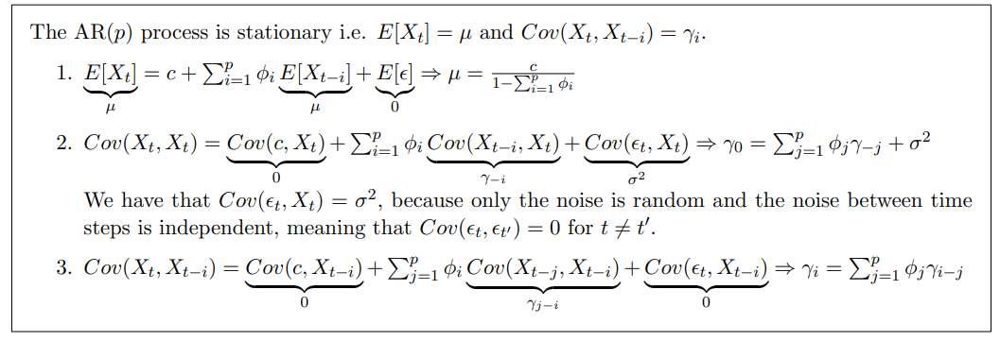
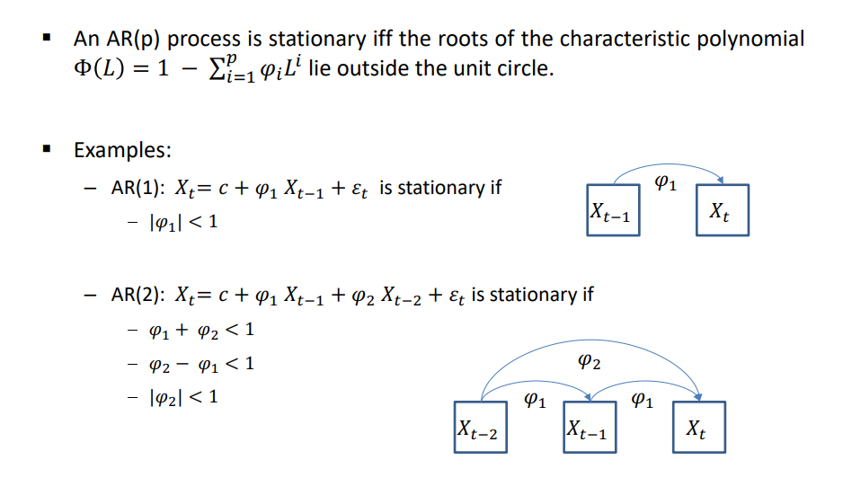
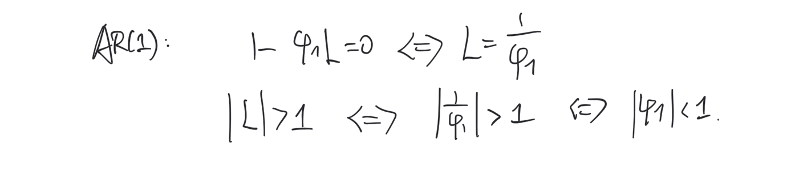
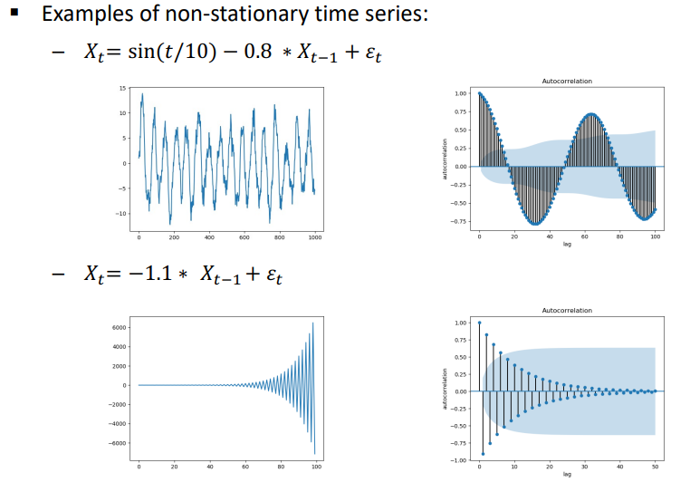

# Autoregressive Models

## Table of Contents

- [Motivation](#Motivation)
- [AR Definition](#AR-Definition)
- [AR to Probabilistic Graphical Models](#AR-to-Probabilistic-Graphical-Models)
  - [Statistics](#Statistics)
- [Stationarity](#Stationarity)
  - [Moments of a Stationary AR(p)](#Moments-of-a-Stationary-ARp)
  - [Stationarity Criterion](#Stationarity-Criterion)
- [Parameter Learning](#Parameter-Learning)
  - [Least Square Regression](#Least-Square-Regression)
  - [Yule Walker Equation](#Yule-Walker-Equation)
  - [General Remarks](#General-Remarks)
  - [Example](#Example)

# Motivation

How do we handle temporal sequential data $X_{1}, X_{2}, \ldots, X_{T}$? For example, $X_{t}$ represents the temperature on the $t$-th day.

- Subsequent data depends on previous data.
- Data is not independent and identically distributed (i.i.d).
- The index $t$ can correspond to time or location.

This leads us to Autoregressive models (AR).

**Assumptions:**

- Observations/data are continuous. In this case, AR models can be converted into probability distribution models: $P\left(X_{t} \mid X_{t-1}, \ldots X_{t-p}\right) \sim N\left(c+\sum_{i=1}^{p} \varphi_{i} X_{t-i}, \sigma\right)$

  AR to Probabilistic Graphical Models.
- Timesteps are discrete.

For discrete observations, refer to [Markov chains](https://www.wolai.com/5zF5a5i3JJRJa5eDY8hsv6.md "Markov chains").

# AR Definition

- Definition: An autoregressive model $AR(p)$ of order $p$ is defined as:

$$
X_{t}=c+\sum_{i=1}^{p} \varphi_{i} X_{t-i}+\varepsilon_{t}
$$

where

- $\varphi_{1}, \ldots, \varphi_{p}$ are the parameters
- $c$ is a constant parameter
- $\varepsilon_{t} \sim N(0, \sigma)$ is a white noise. (**This is not a parameter, but a sample under the fixed normal distribution**)
- The variable $X_{t-i}$ is the lagged value at time $i$.

1. In an AR model of order $p$, $X_{t}$ depends on the previous $p$ data points.
2. All parameters ($\varphi,c$) are global and shared among all data points.

   The subscript $i$ in $\varphi_{i}$ represents the time interval, and all pairs of data points with the same time interval have the same coefficient $\varphi_{i}$.

   For example, $X_{2} = ... + \varphi_{1} \cdot X_{1} + c$ and $X_{5} = ... + \varphi_{1} \cdot X_{4} + c$.
3. The constant $c$ can be a scalar or a function of $t$.

4. Repercussions: Modifying or shocking $X_{t}$ affects all subsequent data $X_{t}^{\prime}$.

# AR to Probabilistic Graphical Models

AR to Probability Distribution Model:

$$

P\left(X_{t} \mid X_{t-1}, \ldots X_{t-p}\right) \sim N\left(c+\sum_{i=1}^{p} \varphi_{i} X_{t-i}, \sigma\right)
$$

The corresponding graphical model:

## Statistics

$t:$ time point

$i:$ time interval

1. The mean function of an AR model is $\mu(t)=E\left[X_{t}\right]$. By default, it depends on $t$.
   - In the stationary case: $E\left[X_{t}\right]$ is constant = $\mu$
2. The autocovariance $\gamma(t, i)=\operatorname{Cov}\left(X_{t}, X_{t-i}\right)$.
   - By default, it depends on $t$ and $i$.
   - In the stationary case: only depends on $i$. The autocovariance of two data points with the same interval is equal: $\gamma_{i}=\operatorname{Cov}\left(X_{t}, X_{t-i}\right)=\operatorname{Cov}\left(X_{t-i}, X_{t}\right)=\gamma_{-i}$
3. The autocovariance function can be normalized to give the Pearson autocorrelation function $\rho(t, i)=\frac{\operatorname{Cov}\left(X_{t}, X_{t-i}\right)}{\sqrt{\operatorname{Var}\left(X_{t}\right)} \sqrt{\operatorname{Var}\left(X_{t-i}\right)}}$. It lies in $[-1,1]$.

**Autocovariance and Pearson autocorrelation both reflect the degree of correlation or dependency between two time-series data points.**

# Stationarity

- Definition: A process is said stationary if

  1. $E\left[X_{t}\right]=E\left[X_{t-i}\right]=\mu, \forall t, \forall i$
  2. $\operatorname{Cov}\left(X_{t}, X_{t-i}\right)=\gamma_{i}, \forall t, \forall i$
  3. $E\left[\left|X_{t}\right|^{2}\right]<\infty, \forall t$

## Moments of a Stationary AR(p)

$$
\begin{aligned}
&-E\left[X_{t}\right]=\mu=\frac{c}{1-\sum_{i=1}^{p} \varphi_{i}}, \forall t \\
&-\operatorname{Var}\left(X_{t}\right)=\gamma_{0}=\sum_{j=1}^{p} \varphi_{j} \gamma_{-j}+\sigma^{2}, \forall t \\
&-\operatorname{Cov}\left(X_{t}, X_{t-i}\right)=\gamma_{i}=\sum_{j=1}^{p} \varphi_{j} \gamma_{i-j}, \forall t, \forall i \in[1, p] \\
&-\rho_{i}=\frac{\gamma_{i}}{\gamma_{0}}
\end{aligned}
$$

To compute these moments, take the expectation or variance of both sides of the equation:

$$
X_{t}=c+\sum_{i=1}^{p} \varphi_{i} X_{t-i}+\varepsilon_{t}
$$

and simplify accordingly.

## Stationarity Test

In exams, this can be treated as a theorem:

- Stationary examples:

  
- Non-stationary examples:

  

# Parameter Learning

## Least Square Regression

## Yule-Walker Equation

## General Remark

## Example

